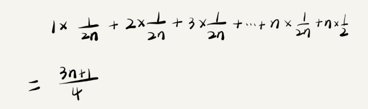
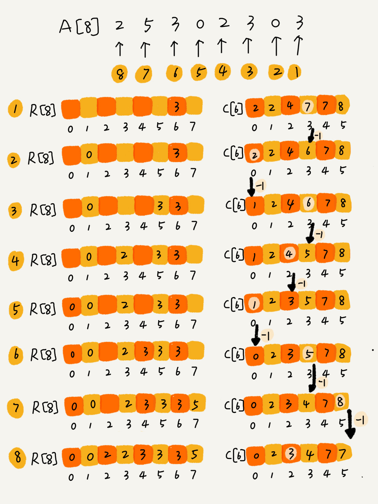
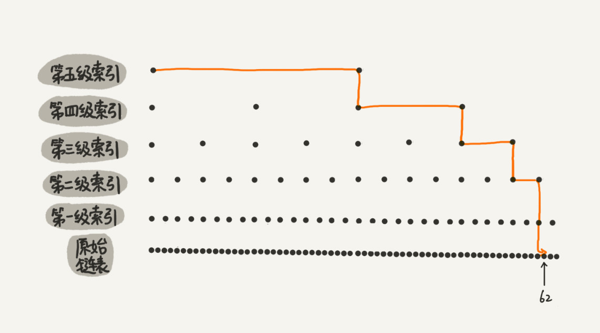
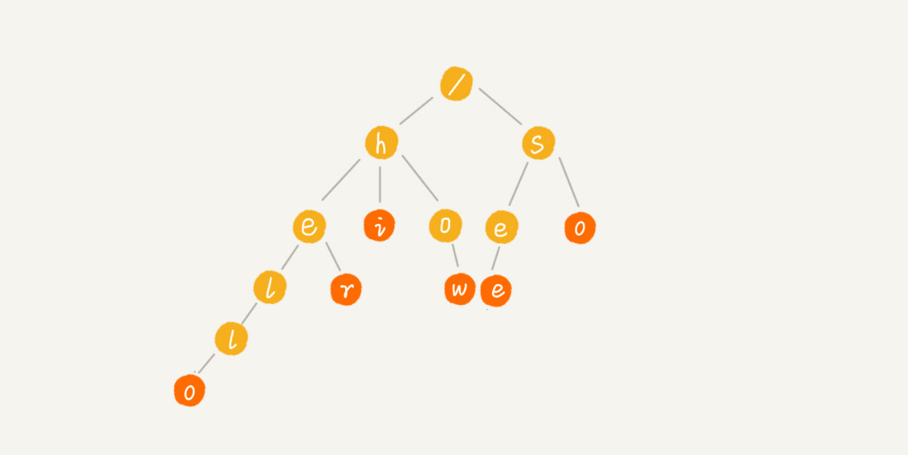
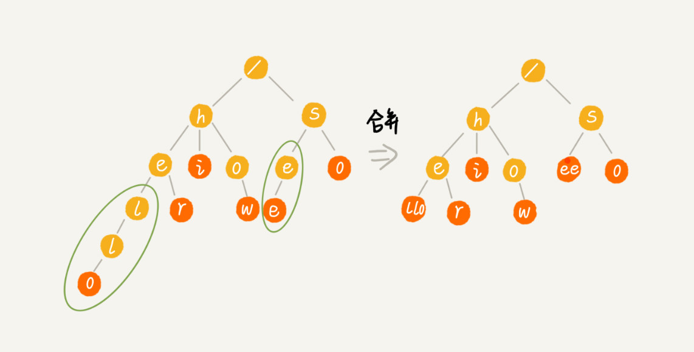

# 数据结构与算法

## 1. 复杂度

### 1.1 时间复杂度


**常量阶**

无论执行多少步，只要是有限的次数，都是常量阶

**对数阶**

如下面示例代码，判断条件不是递增，而是每次按倍数增长

```java
 i=1;
 while (i <= n)  {
   i = i * 2;
 }
```

**O(m+n)，O(m*n)**

```java
int cal(int m, int n) {
  int sum_1 = 0;
  int i = 1;
  for (; i < m; ++i) {
    sum_1 = sum_1 + i;
  }

  int sum_2 = 0;
  int j = 1;
  for (; j < n; ++j) {
    sum_2 = sum_2 + j;
  }

  return sum_1 + sum_2;
}
```

如果m和n的规模无法确定谁大谁小，那代码复杂度就是O(m+n)，不是取最大的那个

### 1.2 空间复杂度

> 常见的空间复杂度有O(1) , O(n) , O(logn)

- 是指除了原本数据的存储空间外，算法运行时还需要的额外的存储空间

### 1.3 最好/最坏时间复杂度

### 1.4 平均时间复杂度

> 又称加权平均时间复杂度

```java
// n 表示数组 array 的长度
int find(int[] array, int n, int x) {
  int i = 0;
  int pos = -1;
  for (; i < n; ++i) {
    if (array[i] == x) {
       pos = i;
       break;
    }
  }
  return pos;
}
```

**使用次数分析**

上面示例中，如果x在数组中，可能的位置是0~n-1，如果不在数组中，就需要多一步比较i=n < n；所以计算所有的情况就是：


一共有n+1种情况，每次计算话费的步数是1+2+…+n+n

**使用概率分析**

x在数组中和不在数组中的概率分别是1/2，在数组中某个位置共有n中情况，所以出现下图



### 1.5 均摊时间复杂度

```java
 // array 表示一个长度为 n 的数组
 // 代码中的 array.length 就等于 n
 int[] array = new int[n];
 int count = 0;
 
 void insert(int val) {
    if (count == array.length) {
       int sum = 0;
       for (int i = 0; i < array.length; ++i) {
          sum = sum + array[i];
       }
       array[0] = sum;
       count = 1;
    }

    array[count] = val;
    ++count;
 }
```

特殊的平均时间复杂度，适用场景

- 大部分情况下的时间复杂度是O(1)
- 操作是有规律性的，如上代码，都是n-1个O(1)，接着一个O(n)

说明：

- 均摊时间可以看作将最坏的一个复杂度为O(n)的操作，均摊到n-1操作上，那时间复杂度就都是O(1)了

Ps：一般均摊时间复杂度等于最好情况时间复杂度

## 2. 栈

> 先进后出

**应用场景**

- 函数调用栈；操作系统为每个线程分配一块独立的内存空间，这种空间被组织成栈，用来存储函数需要的临时变量
- 表达式求值；算术表达式中，将数字入数字栈，操作符入操作符栈
- 括号匹配

## 3. 排序

### 3.1 归并排序(O(nlogn))

> 采用分治思想；分治+合并

**概述**


**递推公式**

```ruby
递推公式：
merge_sort(p…r) = merge(merge_sort(p…q), merge_sort(q+1…r))

终止条件：
p >= r 不用再继续分解
```

**合并策略**


**代码实现**

```java
// 归并排序算法, A 是数组，n 表示数组大小
merge_sort(A, n) {
  merge_sort_c(A, 0, n-1)
}

// 递归调用函数
merge_sort_c(A, p, r) {
  // 递归终止条件
  if p >= r  then return

  // 取 p 到 r 之间的中间位置 q
  q = (p+r) / 2
  // 分治递归
  merge_sort_c(A, p, q)
  merge_sort_c(A, q+1, r)
  // 将 A[p...q] 和 A[q+1...r] 合并为 A[p...r]
  merge(A[p...r], A[p...q], A[q+1...r])
}

// merge伪代码
merge(A[p...r], A[p...q], A[q+1...r]) {
  var i := p，j := q+1，k := 0 // 初始化变量 i, j, k
  var tmp := new array[0...r-p] // 申请一个大小跟 A[p...r] 一样的临时数组
  while i<=q AND j<=r do {
    if A[i] <= A[j] {
      tmp[k++] = A[i++] // i++ 等于 i:=i+1
    } else {
      tmp[k++] = A[j++]
    }
  }
  
  // 判断哪个子数组中有剩余的数据
  var start := i，end := q
  if j<=r then start := j, end:=r
  
  // 将剩余的数据拷贝到临时数组 tmp
  while start <= end do {
    tmp[k++] = A[start++]
  }
  
  // 将 tmp 中的数组拷贝回 A[p...r]
  for i:=0 to r-p do {
    A[p+i] = tmp[i]
  }
}
```

ps：

- merge函数使用哨兵实现，参考`第七讲`
- 应用不广泛原因，不是原地排序，空间复杂度是O(n)

### 3.2 快速排序(O(nlogn))

**原理**

随机选取一个值povit，遍历集合，将小于povit的值放于povit的左边，大于的放于右边。


**递推公式**

```ruby
递推公式：
quick_sort(p…r) = quick_sort(p…q-1) + quick_sort(q+1, r)

终止条件：
p >= r
```

**代码实现**

```java
// 快速排序，A 是数组，n 表示数组的大小
quick_sort(A, n) {
  quick_sort_c(A, 0, n-1)
}
// 快速排序递归函数，p,r 为下标
quick_sort_c(A, p, r) {
  if p >= r then return
  
  q = partition(A, p, r) // 获取分区点
  quick_sort_c(A, p, q-1)
  quick_sort_c(A, q+1, r)
}
```

**partition分区函数**

```java
partition(A, p, r) {
  pivot := A[r]
  i := p
  for j := p to r-1 do {
    if A[j] < pivot {
      swap A[i] with A[j]
      i := i+1
    }
  }
  swap A[i] with A[r]
  return i
```

**分区函数示意图**


**与归并排序区别**


归并排序是由下而上解决问题，先分区再合并；快速排序是由上而下解决问题，分区结束，排序结束

### 3.3 桶排序O(n)

> 当桶的个数接近数据个数时，时间复杂度就是O(n)

问：是什么？

答：将数据进行分桶，桶之间是排好序的，桶内的数据再进行排序，这样所有数据都是排好序的。

问：有什么限制？

答：1⃣️数据要很容易分成m个桶，桶与桶之间的也是排好序的2⃣️桶内数据分布比较均匀，不要发生数据偏移，导致所有数据都在一个桶内，这样的话，时间复杂度就是O(logn)

问：有什么应用场景？

答：比较适合外部排序。外部排序：数据存储在磁盘上，数据量比较大，内存有限，无法将数据全部加在到内存中。

举例：100万的订单数据排序

### 3.4 计数排序O(n)

> 时间复杂度O(n)

问：是什么？

答：一种特殊的桶排序，每个桶内的数值是一样的

问：使用场景

答：1⃣️数值范围小于数值的个数。如：数值范围是0-100，数值个数时1502⃣️只能给非负整数排序

**实现**

1⃣️有一个计数数组，记录<=桶值的数值个数

2⃣️根据计数数组C将原始数组A添加到一个新的数组B（数组A每添加一个元素，对应的桶值计数减1）



```java
// 计数排序，a 是数组，n 是数组大小。假设数组中存储的都是非负整数。
public void countingSort(int[] a, int n) {
  if (n <= 1) return;

  // 查找数组中数据的范围
  int max = a[0];
  for (int i = 1; i < n; ++i) {
    if (max < a[i]) {
      max = a[i];
    }
  }

  int[] c = new int[max + 1]; // 申请一个计数数组 c，下标大小 [0,max]
  for (int i = 0; i <= max; ++i) {
    c[i] = 0;
  }

  // 计算每个元素的个数，放入 c 中
  for (int i = 0; i < n; ++i) {
    c[a[i]]++;
  }

  // 依次累加
  for (int i = 1; i <= max; ++i) {
    c[i] = c[i-1] + c[i];
  }

  // 临时数组 r，存储排序之后的结果
  int[] r = new int[n];
  // 计算排序的关键步骤，有点难理解
  for (int i = n - 1; i >= 0; --i) {
    int index = c[a[i]]-1;
    r[index] = a[i];
    c[a[i]]--;
  }

  // 将结果拷贝给 a 数组
  for (int i = 0; i < n; ++i) {
    a[i] = r[i];
  }
}
```

### 3.5 排序优化

几种排序比较


**快排优化**

> 核心思想：选取合适的分区点，最好被分开的两边数据量一样

- 核心点的选取

  - 三数取中法，五数取中法等
  - 随机法

  。。。

- 避免溢出

  - 限制递归深度
  - 在堆上实现一个函数调用栈，手动模拟递归出入栈，就没有系统栈大小的限制了

## 4. 二分查找(O(long))

**实现**

```java
public int bsearch(int[] a, int n, int value) {
  int low = 0;
  int high = n - 1;

  while (low <= high) {
    int mid = (low + high) / 2;
    if (a[mid] == value) {
      return mid;
    } else if (a[mid] < value) {
      low = mid + 1;
    } else {
      high = mid - 1;
    }
  }

  return -1;
}
```

注意事项：

- 循环条件；是low<=high，不是low<high
- mid取值问题；如果是(low + high) / 2，如果low和high比较大的话，可能造成溢出，应该改成low + (high - low) / 2或者low + ((high - low) >> 1)
- low和high取值是mid + 1和mid - 1；如果写成mid会造成死循环（当low=3，high=3，a[3] != value时）

**使用场景**

- 适合于顺序表（数组），数组的随机访问复杂度时O(1)，而链表的是O(n)，如果用链表，二分查找的复杂度会很高
- 适合于有序的数据
- 不适合与数据量太小的数据；如果比较操作非常耗时的话，也可以用二分查找
- 不适合于数据量太大的数据

## 5. 跳表

> 链表加多级索引的结构

**实现原理**



**时间复杂度**

查询次数之和即为时间复杂度

```ruby
T(n) = h级索引*每级索引的查询次数
n / (2^h) = 2
h = logn - 1
每级索引最多的查询次数是3
时间复杂度就是O(logn)
```

**空间复杂度**

```ruby
n/2 + n/4 + ... + 2 = n - 2
空间复杂度就是O(n)
```

**变形**

```
每三个节点建一个索引，或者每5个节点建一个索引
```

## 6. 散列表

> 利用的是数组随机访问的特性

**散列函数**

- 散列函数计算得到的散列值必须是一个非负整数
- 如果key1==key2，那么hash(key1) == hash(key2)
- 如果key1 != key2，那么hash(key1) != hash(key2)

条件三很容易不满足，现有的MD5，SHA算法等都存在不满足的情况，这种情况叫做散列冲突

**散列冲突**

解决方法有***开放寻址法***，***链表法***

**开放寻址法**

核心思想是：如果发生冲突，就重新探测一个新的位置，将其插入

探测新位置的方法：线性探查，二次方探测，双重散列

优点：1⃣️查询快2⃣️序列化简单

缺点：1⃣️删数据代价高2⃣️散列冲突代价高

**适合场景：**数据量小，装载因子小的时候

*装载因子*表示空位数

```ruby
散列表的装载因子 = 填入表中的元素个数 / 散列表的长度
```

**链表法**

相同散列值的数据放在一个槽中，槽中是一个链表，相同散列值的数据添加在链表中


装载因子过大时要选择动态扩容，减小装载因子；

动态扩容：老散列表重新计算，插入新散列表；

避免低效的动态扩容：插入一条，从老散列表中取一条插入新散列表；查询的时候，先查新散列表，然后查老散列表

## 7.堆

### 条件

```ruby
- 完全二叉树
- 当前节点的数值大于等于（或小于等于）子节点的数值
```

### 堆的实现

> 完全二叉树的实现最好用数组，这里堆采用数组实现

当前节点是n，那左子节点是2n，右子节点是2n+1；如下图


**插入元素**

```ruby
- 放于最后一位
- 从下往上堆化，每次都跟父节点比较，小于（或大于）则交换
```

如图：


```java
public class Heap {
  private int[] a; // 数组，从下标 1 开始存储数据
  private int n;  // 堆可以存储的最大数据个数
  private int count; // 堆中已经存储的数据个数

  public Heap(int capacity) {
    a = new int[capacity + 1];
    n = capacity;
    count = 0;
  }

  public void insert(int data) {
    if (count >= n) return; // 堆满了
    ++count;
    a[count] = data;
    int i = count;
    while (i/2 > 0 && a[i] > a[i/2]) { // 自下往上堆化
      swap(a, i, i/2); // swap() 函数作用：交换下标为 i 和 i/2 的两个元素
      i = i/2;
    }
  }
 }
```

**删除堆顶元素**

```ruby
- 最后一位移到堆顶
- 向下堆化，依次和子节点比较，知道放于合适的位置
```


```java
public void removeMax() {
  if (count == 0) return -1; // 堆中没有数据
  a[1] = a[count];
  --count;
  heapify(a, count, 1);
}

private void heapify(int[] a, int n, int i) { // 自上往下堆化
  while (true) {
    int maxPos = i;
    if (i*2 <= n && a[i] < a[i*2]) maxPos = i*2;
    if (i*2+1 <= n && a[maxPos] < a[i*2+1]) maxPos = i*2+1;
    if (maxPos == i) break;
    swap(a, i, maxPos);
    i = maxPos;
  }
}
```

### 堆排序

> 建堆 + 排序

**建堆**

*当前节点依次向下堆化*


```java
private static void buildHeap(int[] a, int n) {
  for (int i = n/2; i >= 1; --i) {
    heapify(a, n, i);
  }
}

private static void heapify(int[] a, int n, int i) {
  while (true) {
    int maxPos = i;
    if (i*2 <= n && a[i] < a[i*2]) maxPos = i*2;
    if (i*2+1 <= n && a[maxPos] < a[i*2+1]) maxPos = i*2+1;
    if (maxPos == i) break;
    swap(a, i, maxPos);
    i = maxPos;
  }
}
```

*建堆的时间复杂度是O(n)*

**排序**

依次删除堆顶元素（堆顶元素是最大或者最小，依次将堆顶元素放于队首或队尾）


```java
// n 表示数据的个数，数组 a 中的数据从下标 1 到 n 的位置。
public static void sort(int[] a, int n) {
  buildHeap(a, n);
  int k = n;
  while (k > 1) {
    swap(a, 1, k);
    --k;
    heapify(a, k, 1);
  }
}
```

*排序的时间复杂度是log(n)，所以堆排序的时间复杂度是O(nlogn)*

### 堆排序为什么没有快排好

- 堆排序数据访问的方式没有快排友好

  堆排序，数据是跳着访问的，这样对cpu缓存是不友好的

- 同样的数据，堆排序的数据交换次数要多于快排

## 8.图

### 存储方式

*邻接表 或 邻接矩阵*

### 深度优先和广度优先搜索

## 9.字符串匹配算法

**BF算法（Brute Force）**

- 暴力匹配算法，也叫朴素匹配算法
- 主串和模式串；主串指字符串A，模式串指要查找的字符串
- 时间复杂度O(n*m)

**RK算法（Rabin-Karp）**

- 利用哈希算法提高查找的效率

- 哈希算法的设计

  ```ruby
  - 有K个字符串就设置K进制，将K进制转为十进制，作为hash值
  - 计算模式串的hash值和子串的hash值
  - 将模式串的hash值，与子串的hash值进行比较
  ```

- 时间复杂度O(n)

### BM算法（Boyer-Moore）

> 核心是增大匹配字符串的移动位数

- 算法包含两部分：坏字符规则和好后缀规则
- max(坏字符规则移动的距离，好后缀规则移动的距离)
- 移动字符串

**坏字符规则**

从后往前一次比较，如果发现主串中的字符和模式串中的字符不同，那当前字符是坏字符；这是就需要移动模式串，移动的时候需要注意一点。如果坏子符在模式串中，将模式串移动到坏字符的位置；如果不包含，移动到坏字符后面。如下图所示：

*模式串中不包含坏字符*


*模式串中包含坏字符*


**好后缀规则**

模式串中的最后几位可以匹配到，但是中间几位匹配不到，这时的最后几位就是好后缀。移动模式串时也要注意，模式串中的其他子串是否和好后缀一样，分别时中间一样和前面一样。


[**代码实现**](https://time.geekbang.org/column/article/71525)

### KMP算法（Knuth Morris Pratt）

> 核心是当遇到坏字符时，好前缀中移动最大的位数

提前记录好好前缀中最长可匹配前缀字符串的尾字符下标，那么下一个下标就是下一次比较的值；用next[]记录，叫做**失效函数**


如图：第三列中可以理解为，模式串前缀（第一列）中的最长好后缀和最长好前缀相同时，的好前缀的尾下标。拿最后一个举例：a b a b a c,

```ruby
- 后缀分别是 c | a c | b a c | a b a c | b a b a c
- 前缀分别是 a | a b | a b a | a b a b | a b a b a
- 可以看出后缀子串中没有和前缀子串相同的，所以next[5] = -1
```

这样的处理可以这样理解：遇到坏字符需要向后移动，匹配的字符串中如果最长后缀子串和最长前缀子串相同，直接移动即可。

**完整的kmp代码如下**

```java
// a, b 分别是主串和模式串；n, m 分别是主串和模式串的长度。
public static int kmp(char[] a, int n, char[] b, int m) {
  int[] next = getNexts(b, m);
  int j = 0;
  for (int i = 0; i < n; ++i) {
    while (j > 0 && a[i] != b[j]) { // 一直找到 a[i] 和 b[j]；相当于移动模式串
      j = next[j - 1] + 1;
    }
    if (a[i] == b[j]) {
      ++j;
    }
    if (j == m) { // 找到匹配模式串的了
      return i - m + 1;
    }
  }
  return -1;
}
```

**失效函数的实现**

### trie树

> 即字典树；本质是利用字符中间的公共前缀，蒋重复的前缀合并到一起



如图所示，①一个字符占据一个几点；②字符串的最后一个字符必须是叶节点，否则不是完整的字符串

**实现**

*注意事项*

- 多叉树
- 子节点们的存储设计；如果是纯英文的，可以将子字符设为26位的字符数组，通过target - 'a'找到位置
- 字符串需要最后一个字符是子节点；如果最后一个字符不是子节点，就只是前缀相同
- leetcode题库链接`https://leetcode-cn.com/problems/implement-trie-prefix-tree/`

```java
public class Trie {
  private TrieNode root = new TrieNode('/'); // 存储无意义字符

  // 往 Trie 树中插入一个字符串
  public void insert(char[] text) {
    TrieNode p = root;
    for (int i = 0; i < text.length; ++i) {
      int index = text[i] - 'a';
      if (p.children[index] == null) {
        TrieNode newNode = new TrieNode(text[i]);
        p.children[index] = newNode;
      }
      p = p.children[index];
    }
    p.isEndingChar = true;
  }

  // 在 Trie 树中查找一个字符串
  public boolean find(char[] pattern) {
    TrieNode p = root;
    for (int i = 0; i < pattern.length; ++i) {
      int index = pattern[i] - 'a';
      if (p.children[index] == null) {
        return false; // 不存在 pattern
      }
      p = p.children[index];
    }
    if (p.isEndingChar == false) return false; // 不能完全匹配，只是前缀
    else return true; // 找到 pattern
  }

  public class TrieNode {
    public char data;
    public TrieNode[] children = new TrieNode[26];
    public boolean isEndingChar = false;
    public TrieNode(char data) {
      this.data = data;
    }
  }
}
```

**时间复杂度：**O(n)

**内存优化：**缩点优化；原理如下图



**使用限制**

- 字符串中包含的字符集不能太大
- 要求字符串的前缀重合的较多，不然空间消耗会变大
- 需要从零开始实现trie树
- trie树使用指针，对缓存不友好；缓存是希望连续的内存空间，但是trie不是连续的

**使用场景**

*trie比较适合查找前缀匹配的字符串*

### AC自动机

> Aho-Corasick两人研究的算法

**使用场景**

在主串中匹配多个模式串

**基本原理**

KMP + trie树

trie树可以匹配多个模式串，KMP可以增加效率

**基本步骤**

- 将多个模式串构建trie树

- 类比kmp算法的next指针，ac自动机需要fail指针

  ```ruby
  fail指针详解：
  - 每个节点都有一个fail指针
  - 当前节点fail指针指向一个节点A；根节点到当前节点的最长后缀等于根节点的子节点到节点A的整条线上
  - 这样的好处是：已经匹配了模式串A的部分字符，直接可以匹配下一个模式串，不需要对重复的字符进行匹配
  - 对第三点举例：有两个模式串：abcde，bcdf；如果记录模式串abcde的每个字符节点的fail指针；当比较到   d时，直接从bcde模式串的f进行比较，不需要重复比较bcd
  ```

**匹配代码**

```java
public void match(char[] text) { // text 是主串
    int n = text.length;
    AcNode p = root;
    for (int i = 0; i < n; ++i) {
        int idx = text[i] - 'a';
        while (p.children[idx] == null && p != root) {
            p = p.fail; // 失败指针发挥作用的地方
        }
        p = p.children[idx];
        if (p == null) p = root; // 如果没有匹配的，从 root 开始重新匹配
        AcNode tmp = p;
        while (tmp != root) { // 打印出可以匹配的模式串
            if (tmp.isEndingChar) {
                int pos = i-tmp.length+1;
                System.out.println(" 匹配起始下标 " + pos + "; 长度 " + tmp.length);
            }
            tmp = tmp.fail;
        }
    }
}
```

**fail指针计算**

## 10.回溯算法

### 8皇后问题

**问题描述**

在8阶矩阵棋盘中，放置8个棋子，每个棋子的行、列、对角线都不能有另一个棋子

**代码实现**

https://github.com/zwyin1993/hello-world/blob/master/StructurePractice/src/com/me/practice/struc/CalEightQueen.java

## 11.动态规划

### 什么样的问题可以使用动态规划？

**一个模型三个特征**

**多阶段决策最优解模型**：动态规划一般解决最优问题，解决问题的过程需要经历多个决策阶段。每个阶段都对应一组状态。然后寻找一组决策序列，经过这组决策序列，能够产生最终期望求解的最优值。

**最优子结构**：问题的最优解包含子问题的最优解。后面阶段的状态可以通过前面阶段的状态推导出来

**无效性**：1⃣️后面的状态值只关心前面阶段的状态值，不关心前面阶段状态值的推导过程2⃣️某阶段状态确定后，不受后面阶段的决策影响。

**重复子问题**：不同的阶段存在重复的状态

### 样例

> 后面使用这个样例求解

**求最短路径**


求起点到终点的最短路径

对应上述的**一个模型**如下图：


### 动态规划解题思路总结

#### 状态转移法

①尝试使用回溯法解决，如果可以进行第②步

②画出递归树，判断递归树中是否存在重复问题，如果存在则可以使用动态规划实现

​    

三个参数分别是：行坐标，列坐标，起点到改点的最短路径

③使用二维表座位状态表，推断出首行首列的状态，不断跌断推导将状态表填满，最后即可得出到终点的最短路径


第③步的代码实现

```java
public int minDistDP(int[][] matrix, int n) {
  int[][] states = new int[n][n];
  int sum = 0;
  for (int j = 0; j < n; ++j) { // 初始化 states 的第一行数据
    sum += matrix[0][j];
    states[0][j] = sum;
  }
  sum = 0;
  for (int i = 0; i < n; ++i) { // 初始化 states 的第一列数据
    sum += matrix[i][0];
    states[i][0] = sum;
  }
  for (int i = 1; i < n; ++i) {
    for (int j = 1; j < n; ++j) {
      states[i][j] = 
            matrix[i][j] + Math.min(states[i][j-1], states[i-1][j]);
    }
  }
  return states[n-1][n-1];
}
```

#### 状态转移方程式

> 关键是方程式的编写

上述最短路径的方程式

```ruby
min_dist(i, j) = w[i][j] + min(min_dist(i, j-1), min_dist(i-1, j))
```

*//完善*

## 12.拓扑排序

> 场景：通过局部顺序推导全局顺序

### kahn算法

将所有的节点构建一个有向无环图，一次输出入度为零的节点，就是全局顺序

**代码实现**

```java
public void topoSortByKahn() {
  int[] inDegree = new int[v]; // 统计每个顶点的入度
  for (int i = 0; i < v; ++i) {
    for (int j = 0; j < adj[i].size(); ++j) {
      int w = adj[i].get(j); // i->w
      inDegree[w]++;
    }
  }
  LinkedList<Integer> queue = new LinkedList<>();
  for (int i = 0; i < v; ++i) {
    if (inDegree[i] == 0) queue.add(i);
  }
  while (!queue.isEmpty()) {
    int i = queue.remove();
    System.out.print("->" + i);
    for (int j = 0; j < adj[i].size(); ++j) {
      int k = adj[i].get(j);
      inDegree[k]--;
      if (inDegree[k] == 0) queue.add(k);
    }
  }
}
```

### DFS算法

> 深度优先遍历算法

**思想**

深度优先遍历一次输出尾结点的数值

**流程**

- 构建逆邻接矩阵；原来的矩阵是A->B，如果按照这个顺序深度优先遍历，那输出的顺序就是反的；现在优先构建B->A的路径，深度优先遍历后的结果就是正序
- 深度优先遍历，递归的输出每个节点，先输出子节点，在输出当前节点

**代码实现**

```java
public void topoSortByDFS() {
  // 先构建逆邻接表，边 s->t 表示，s 依赖于 t，t 先于 s
  LinkedList<Integer> inverseAdj[] = new LinkedList[v];
  for (int i = 0; i < v; ++i) { // 申请空间
    inverseAdj[i] = new LinkedList<>();
  }
  for (int i = 0; i < v; ++i) { // 通过邻接表生成逆邻接表
    for (int j = 0; j < adj[i].size(); ++j) {
      int w = adj[i].get(j); // i->w
      inverseAdj[w].add(i); // w->i
    }
  }
  boolean[] visited = new boolean[v];
  for (int i = 0; i < v; ++i) { // 深度优先遍历图
    if (visited[i] == false) {
      visited[i] = true;
      dfs(i, inverseAdj, visited);
    }
  }
}

private void dfs(
    int vertex, LinkedList<Integer> inverseAdj[], boolean[] visited) {
  for (int i = 0; i < inverseAdj[vertex].size(); ++i) {
    int w = inverseAdj[vertex].get(i);
    if (visited[w] == true) continue;
    visited[w] = true;
    dfs(w, inverseAdj, visited);
  } // 先把 vertex 这个顶点可达的所有顶点都打印出来之后，再打印它自己
  System.out.print("->" + vertex);
}
```

