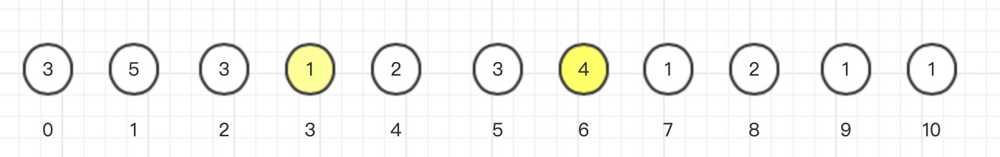

# 链表

> 主要是画图，图画出来了，题基本就解出来了，同时要注意边界条件

[链表题解汇总](https://leetcode-cn.com/problems/middle-of-the-linked-list/solution/kuai-man-zhi-zhen-zhu-yao-zai-yu-diao-shi-by-liwei/)

## 快慢指针

> 根据快慢指针的固定间隔来求解

- leetcode第876题[链表的中间节点](https://leetcode-cn.com/problems/middle-of-the-linked-list/)快节点每次走两步，慢节点每次走一步，当快节点指向尾节点时，慢节点执行中间节点（偶数时，慢节点指向中间节点的第一个）

- leetcode第19题[倒数第K个节点](https://leetcode-cn.com/problems/remove-nth-node-from-end-of-list/)快慢指针相隔K个节点，当快指针指向尾节点时，慢节点指向倒数第K个节点

- leetcode第141题[环形链表](https://leetcode-cn.com/problems/linked-list-cycle/submissions/)快慢指针总有相遇的时候

## 递归

- leetcode第206题：[单链表反转](https://leetcode-cn.com/problems/reverse-linked-list/submissions/)，三个指针dummy，pre，curr实现交换

- leetcode第24题：[交换相邻节点](https://leetcode-cn.com/problems/swap-nodes-in-pairs/)
- leetcode第25题：[k个一组反转链表](https://leetcode-cn.com/problems/reverse-nodes-in-k-group/)

- leetcode第328题：[奇偶链表相连](https://leetcode-cn.com/problems/odd-even-linked-list/submissions/)，4个节点；奇偶各一个虚节点，奇偶各一个当前节点。


# 45.跳跃问题

> 计算跳到最后一步，**最少**走几步

[leetcode链接](https://leetcode-cn.com/problems/jump-game-ii/)

==？==试着用广度优先搜索实现

**贪心算法**

**核心思想：**每一步跳跃尽可能多的下标



如图：第一步最多可以跳到3，然后计算第二步的下标；从1～3，最远的情况是下标为1，最远到达6，而不是直接取下标为3的情况

```java
public int jump(int[] nums) {
  int end = 0;
  int maxPosition = 0;
  int steps = 0;
  for(int i = 0; i < nums.length - 1; i++){
    //找能跳的最远的
    maxPosition = Math.max(maxPosition, nums[i] + i);
    if (i == end){ //遇到边界，就更新边界，并且步数加一
      if (end == maxPosition) { // 下个边界==上个边界，永远到不了最后；但是step是2
        return 0;
      }
      end = maxPosition;
      steps++;
    }
  }
  return steps;
}
```

- 第9行的判断，是考虑跳跃0，到不了最后的情况
- for循环中，nums.length - 1是因为恰好到了终点，那么不需要再走一步，但是条件$i == end$会使step多+1

**动态规划**

**核心思想：**计算每一步到最后最少需要走几步

```java
public int jump(int[] nums) {
  if (nums.length == 0 || nums[0] == 0) {
    return 0;
  }
  int[] arr = new int[nums.length]; // 暂存每一步到最后位置的跳跃次数
  int lastIndex = nums.length - 1;
  for (int index = lastIndex - 1; index >= 0; index--) {
    if (index + nums[index] >= lastIndex) {
      arr[index] = 1;
      continue;
    }
    if (nums[index] == 0) { // 当前位置跳跃步数为0，永远到不了最后
      arr[index] = 0;
      continue;
    }
    int min = Integer.MAX_VALUE;
    for (int step = 1; step <= nums[index]; step++) {
      int next = arr[index + step];
      if (next == 0) { // 下一步到不了最后
        continue;
      } 
      min = min > next ? next : min;
    }
    arr[index] = min == Integer.MAX_VALUE ? 0 : min + 1;
  }
  return arr[0];
}
```

二者比较：

贪心的时间复杂度是O(n)，空间复杂度是O(1)，动态规划的时间复杂度是O(n*m)，空间复杂度是O(n)；实测也是贪心的耗时更少；当解决**最优解**的时候，贪心算法更好

## 引申

**跳到最后有多少种可能**

状态方程：$f(n) = f(n+1) + f(n+2) +...+f(n+m)$

```java
public int jumps(int[] arr) {
  int[] result = new int[arr.length];
  result[arr.length - 1] = 1;
  for (int i = arr.length - 2; i >= 0; i--) {
    result[i] = 0;
    if (arr[i] == 0) {
      continue;
    }
    for (int j = 1; j <= arr[i]; j++) { // j表示每次跳跃的步数，当前的节点可能行=每次跳跃的可能性相加
      if (i + j > arr.length - 1) {
        break;
      }
      result[i] += result[i + j];
    }
  }
  return result[0];
}
```

**55.是否能跳到最后**

状态方程：$f(n) = f(n+1) || f(n+2) || ... || f(n+m)$

```java
class Solution {
    // 如果是GOOD，那此节点不需要比较，直接返回true
    // 动态规划，自底向上检查
    public boolean canJump(int[] nums) {
        Status[] status = new Status[nums.length];
        for (int i = 0; i < nums.length; i++) {
            status[i] = Status.UNKONW;
        }
        status[status.length - 1] = Status.GOOD; // 最后节点肯定是好的
        for (int i = status.length - 2; i >= 0; i--) {
            int furthestPos = Math.min(i + nums[i], status.length - 1); // 如果超出右边界，最远可到达右边界
            // 计算当前节点是否可到达最后一位
            for (int j = i + 1; j <= furthestPos; j++) {
                if (status[j] == Status.GOOD) {
                    status[i] = Status.GOOD;
                    break;
                }
            }
        }
        return status[0] == Status.GOOD;
    }
}

enum Status {
    GOOD, BAD, UNKONW;
}
```

# N阶矩阵问题

## N阶矩阵全排列/N皇后问题

> [leetcode第46题全排列](https://leetcode-cn.com/problems/permutations/)
>
> [leetcode第51题N皇后](https://leetcode-cn.com/problems/n-queens/)
>
> 回溯算法，都是为每一行填入适当的值和之前的行比较确定该行的值，不同的是：全排列只需要比较上方即可，而N皇后还需要比较斜上方
>
> [优秀题解+回溯讲解](https://leetcode-cn.com/problems/permutations/solution/hui-su-suan-fa-python-dai-ma-java-dai-ma-by-liweiw/)

**解答要点**

- 新建长度为N的数组暂存每一次的结果，其中数组下标代表行，数组值代表列
- 递归，依次计算每一行的所填值；递归跳出条件为：`当前行>=N​`

**代码实现**

***全排列***

```java
public void calc(int[] nums, int row) {
    if (row >= nums.length) {
        Integer[] tmp = Arrays.copyOf(this.arr, this.arr.length);
        this.result.add(Arrays.asList(tmp));
    }
    for (int col = 0; col < nums.length; col++) {
        if (isOk(row, nums[col])) { // 这里要比较的是nums里的值，不是列数
            this.arr[row] = nums[col];
            calc(nums, row + 1);
        }
    }
}

public boolean isOk(int row, int col) {
    for (int i = row - 1; i >= 0; i--) { // 只比较上方
        if (this.arr[i] == col) {
            return false;
        } 
    }
    return true;
}
```

***N皇后***

```java
public void calc(int[] nums, int row) {    
	if (row >= nums.length) {
        Integer[] tmp = Arrays.copyOf(this.arr, this.arr.length);
        this.result.add(Arrays.asList(tmp));
    }
    for (int col = 0; col < nums.length; col++) {
        if (isOk(row, col)) {
            this.arr[row] = col;
            calc(nums, row + 1);
        }
    }
}

public boolean isOk(int row, int col) {
    int left = col - 1;
    int right = col + 1;
    for (int i = row - 1; i >= 0; i--) {
        if (this.arr[i] == col) { // 上
            return false;
        }
        if (left >= 0 && this.arr[i] == left) { // 左斜上
        	return false;
        }
        if (right < this.arr.length && this.arr[i] == right) {// 右斜上
        	return false;
        }
        left--;
        right++;
    }
    return true;
}
```

# 广度优先遍历(BFS)

## Leetcode 1162题 地图问题

三个题解结合更好理解：

[第一个题解了解什么是广搜多源](https://leetcode-cn.com/problems/as-far-from-land-as-possible/solution/zhen-liang-yan-sou-huan-neng-duo-yuan-kan-wan-miao/)：一次取出当前层的所有节点

[第二个题解了解java实现](https://leetcode-cn.com/problems/as-far-from-land-as-possible/solution/li-qing-si-lu-wei-shi-yao-yong-bfs-ru-he-xie-bfs-d/)

[第三个题解了解广度优先遍历的总结](https://leetcode-cn.com/problems/as-far-from-land-as-possible/solution/yan-du-you-xian-bian-li-java-by-liweiwei1419/)

**代码注意事项**

- 要有一个记录是否遍历过元素的标志位，避免重复计算
- 要确定应该往队列中塞**何值**，不同的场景塞的值不同
- 要仔细考量层级的叠加，确定是从0开始还是-1开始